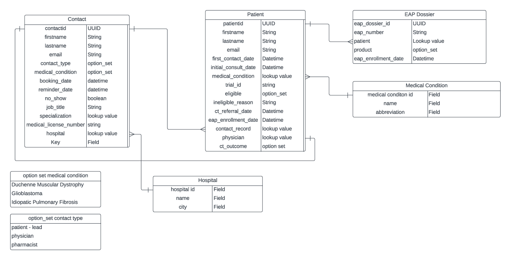
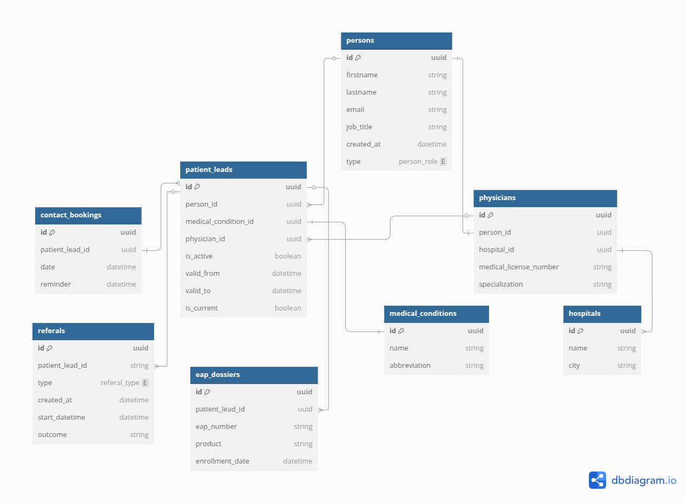

# MyT_assignment
MyTomorrows take home assignment

The purpose of this assessment is to redesign a given data model which tracks the flow of medical procedures.

The Initial E/R Diagram of the system was this one:



# 1.1 Proposed New Data Model

## Main Entities:

### Person
Centralized entity for all individuals interacting with the system (patients, physicians, pharmacists, and navigators)..
    
    Fields: 
        id (UUID): Unique identifier.
        firstname (String): First name.
        lastname (String): Last name.
        email (String): Contact email.
        job_title (String, nullable): Role-specific title (e.g., "Oncologist").
        created_at (Datetime): Timestamp of record creation.
        type (person_role): Role type (patient, physician, pharmacist, patient_navigator).

    Assumptions:
        All user types share common attributes.
        Specific role details (e.g., medical licenses) are stored in dedicated tables.

### PatientLead
Inherits from Person and tracks patient journeys, including historical records for re-entries.
    
    Fields: 
        id (UUID): Unique identifier.
        person_id (UUID): Reference to person.
        medical_condition_id (UUID): Reference to medical_conditions.
        physician_id (UUID): Reference to the treating physician.
        is_active (Boolean): Whether the lead is currently active.
        valid_from (Datetime): Start of this lead version.
        valid_to (Datetime, nullable): End of this lead version.
        is_current (Boolean): Indicates the latest version.
    
    Assumptions:
        A contact (patient) can only have one medical condition at once, that is why I have kept the column here

### Physicians
Inherits from Person and stores professional details of physicians..
    
    Fields: 
        id (UUID): Unique identifier.
        person_id (UUID): Reference to person.
        hospital_id (UUID): Reference to hospitals.
        medical_license_number (String): Unique license identifier.
        specialization (String): Medical specialty.
    
    Assumptions:
        A physician is linked to one hospital.
        License numbers are globally unique.

### Referals
Tracks patient referrals to Clinical Trials (CT) or Expanded Access Programs (EAP).
    
    Fields: 
        id (UUID): Unique identifier.
        patient_lead_id (UUID): Reference to patient_leads.
        type (referal_type): CT or EAP.
        created_at (Timestamp): Referral creation time.
        start_datetime (Datetime): Referral start date.
        outcome (String): Result of the referral.
    
    Assumptions: 
        A patient can have multiple referrals.
        Outcomes are free-text for flexibility.

### Contact_bookings: 
Manages scheduled calls/meetings between patients and navigators.
    
    Fields:
        id (UUID): Unique identifier.
        patient_lead_id (UUID): Reference to patient_leads.
        date (Datetime): Scheduled datetime.
        reminder (Datetime, nullable): Reminder timestamp.
    
    Assumptions:
        A patient lead can have multiple bookings.
        Reminders are optional.


### Medical_conditions
Lookup table for medical conditions (replaces option_set).

    Fields:
        id (UUID): Unique identifier.
        name (String): Full condition name.
        abbreviation (String): Short form (e.g., "DMD").
    
    Assumptions: 
        None

### Hospitals
Stores hospital details.

    Fields: 
        id (UUID): Unique identifier.
        name (String): Hospital name.
        city (String): Location.

    Assumptions:
        Hospitals are static entities.

### EAP_dossiers
Records EAP enrollments for patients.
    
    Fields:
        id (UUID): Unique identifier.
        patient_lead_id (UUID): Reference to patient_leads.
        eap_number (String): Unique EAP identifier.
        product (String): Medication/therapy in the EAP.
        enrollment_date (Datetime): Start of enrollment.

    Assumptions:
        A patient can enroll in multiple EAPs.


## Relationships:

- "-" Means one to one
- "<" Means one to many
- ">" Means many to one

Ref: "physicians"."person_id" - "person"."id"
Ref: "patient_leads"."medical_condition_id" - "medical_conditions"."id"

Ref: "physicians"."id" < "patient_leads"."physician_id"
Ref: "physicians"."hospital_id" < "hospitals"."id"
Ref: "patient_leads"."id" < "referals"."patient_lead_id"

Ref: "patient_leads"."person_id" > "person"."id"
Ref: "patient_leads"."id" > "contact_bookings"."patient_lead_id"

## New model diagram




## Advantages:

Eliminates redundancy of medical_condition by using a single table.

Separates roles (Contact/Patient) using inheritance and avoids confusing fields.

Supports multiple referrals (EAP/CT) and appointments without data loss.

# 1.2 Migration to the New Model (order does matter for consistency)

## 1.2.1 Contact & Patient Consolidation:

Contact and Patient records merge into person (common fields) and patient_leads (journey tracking).

SQL queries:
    Insert all contacts in persons filling the corresponding fields where person.type = contact.contact_type
    For physicians include their job title
    Create person records for Patients not already captured as Contacts (if there are, which should not)
    Insert all patients in patient_leads ...


## 1.2.3 Create table physicians:

Insert all contacts with contact.contact_type = 'physician' filling the corresponding fields and joining the table hospitals to match name and insert hospital ID (assuming no names are repeated)


## 1.2.4 Patient Leads Migration:

Convert Patient records and eligible Contacts into patient_leads with version tracking.

1.- Migrate all Patient records:
    Link to person by ID
    Map medical conditions by name matching
    Set is_active based on eligible status
    Mark all as current (is_current=True) initially

2.- Migrate eligible Contacts (patient-leads):
    Only those not already converted to patients
    Set is_active=False initially (pre-conversion state)
    Maintain original booking dates

## 1.2.5: Medical Conditions Migration:

Convert option_set medical conditions to proper lookup table.

Process:

1.- Create entries for the three predefined conditions:
    Duchenne Muscular Dystrophy
    Glioblastoma
    Idiopathic Pulmonary Fibrosis

2.- Dynamically add any other conditions found in Patient records:
    Extract from medical_condition field
    Generate abbreviations by taking first 3 letters of sanitized names

## 1.2.6 EAP Data Migration:

Move EAP Dossier information to the new structure.

1.- Migrate all EAP Dossier records:
    Link to patient_leads via person_id matching
    Preserve all original EAP information
    Maintain original enrollment dates

## 1.2.5 Hospital Data Migration:
Convert hospital lookup values to proper table.

1.- Create hospital entries from physician Contacts:
    Extract unique hospital names
    Set default city as 'Unknown'

2.- Add any additional hospitals from Patient records:
    Only those not already captured
    Same city default handling


## Key Migration Notes:

The process must follow strict sequence due to dependencies
All original IDs are preserved where possible
System starts with all patient_leads marked as current (versioning begins post-migration)
Missing city information is handled with defaults
The migration captures both the static option_set values and dynamic lookup values that existed in the original system


# 2 API creation

Made an API with CRUD operations for the patient model.

## Decisions & Assumptions
- Async PostgreSQL driver (asyncpg) for better performance
- Temporal versioning for patient leads
- Logical deletion instead of physical
- Centralized error handling
- Configurable DNS for container networking


## Deployment Production-like
1. Create files in `secrets/` with your real credentials. (Temporal solution)
2. Exec:
   ```bash
   docker-compose -f docker-compose.prod.yml up -d
   ```


# Testing

Added some test to validate both the DB and its logic and the API endpoints

```bash
docker-compose -f docker-compose.test.yml up --build --abort-on-container-exit
```

# Considerations

While I currently don't have hands-on experience with Terraform, I understand its critical role in modern cloud deployments. 
For a production-grade setup of this application, the ideal approach would involve leveraging Infrastructure-as-Code (IaC) principles to ensure reproducibility and scalability. 

Here’s how I would architect the solution conceptually:

1.- Cloud Provider Setup:
    Deploy the API container to AWS Elastic Container Service (ECS) for automated scaling, and replace the PostgreSQL container with a managed cloud database (AWS RDS) for high availability and automated backups.

2.- Infrastructure Definition:
    Use Terraform to declaratively define all components – VPC networks, security groups, load balancers, and database instances – ensuring identical environments across stages.

3.- Secrets Management:
    Integrate with AWS Secrets Manager to securely inject credentials (DB_URL, and more in the future) at runtime rather than using environment variables.

4.- CI/CD Pipeline:
    Implement a GitHub Actions / GitLab CI/CD pipeline to automatically rebuild Docker images on code changes and trigger Terraform plan/apply workflows for controlled deployments.


